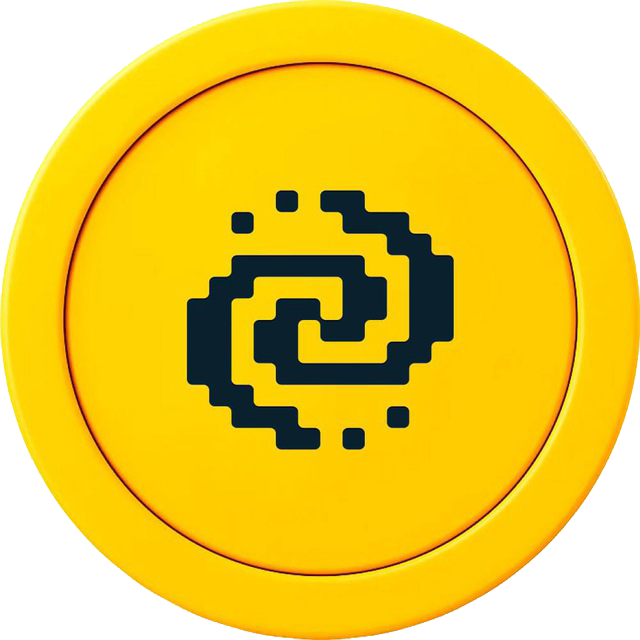
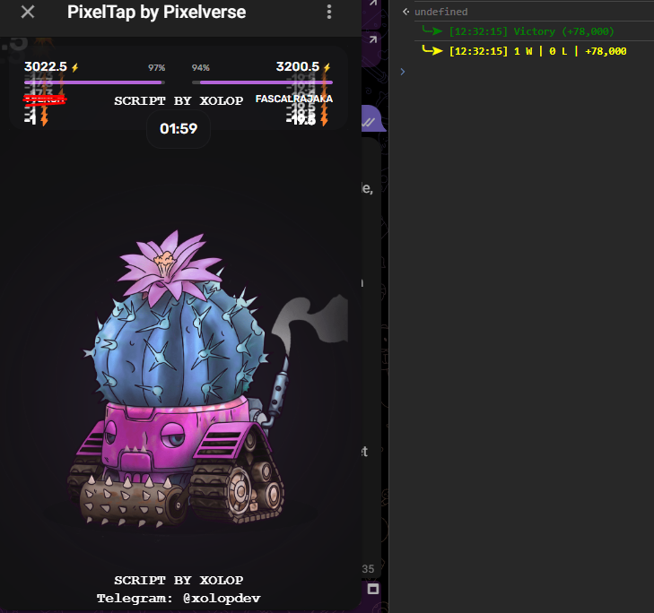

<br clear="both">

<div align="center">
  
</div>
<a href="https://git.io/typing-svg"></a>
<div align="center">
  
**`scripts? cheats? autobot? crypto? telebot? - I will do!`**
</div>
<h2 align="center">Socials</h2>

<div align="center">
  <a href="https://t.me/xolopdev" target="_blank">

  
  </a>
    <a href="https://github.com/o-xolop-o" target="_blank">

  </a>
</div>


<div align="center">

[](https://t.me/pixelversexyzbot?start=1132612218)

  <h1 align="center">Автокликер для игры PixelTap</h1>
  
  <p align="center">
    <strong>Данный бот предназначен для автоматизации боев</strong>
  </p>
  

</div>

## Установка скрипта

1. Откройте Telegram Web в любом браузере и перейдите в бота <a href="https://t.me/pixelversexyzbot?start=1132612218">PixelTap</a>

2. Нажмите ПКМ в любую **область мини-игры** и нажмите исследовать элемент
3. В открывшейся области нажмите на вкладку "Консоль" 
4. В конце всего текста в этой вкладке после знака "**>**" вставьте скрипт, предоставленный ниже
5. Запустите бой
6. Кликните в область со скриптом и нажмите **Enter**

```JavaScript
const consoleStyles = {
    red: 'font-weight: bold; color: red;',
    green: 'font-weight: bold; color: green;',
    yellow: 'font-weight: bold; color: yellow;',
    prefix: '%c ╰┈➤ '
};

const sleep = ms => new Promise(resolve => setTimeout(resolve, ms));
const originalConsoleLog = console.log;

['log', 'error', 'warn', 'info', 'debug'].forEach(method => {
    console[method] = function (...args) {
        if (args[0].includes('╰┈➤') || args[0].includes('github.com')) {
            originalConsoleLog.apply(console, args);
        }
    };
});

console.clear();
console.log(`${consoleStyles.prefix}Loading...`, consoleStyles.green);

const clickElement = element => element?.click();

let lastClickedElement = null;
let waitingGame = false;
const stats = {
    victories: 0,
    defeats: 0,
    totalCoins: 0,
    tryConnect: 0
};

const handleBattleMode = () => {
    waitingGame = false
    const superAttackCards = document.querySelectorAll('._card_n90wq_1');
    
    if (superAttackCards.length) {
        clickElement(superAttackCards[Math.floor(Math.random() * superAttackCards.length)]);
    } else {
        const clickableElement = document.querySelector('.clickableArea') || lastClickedElement;
        clickElement(clickableElement);
        lastClickedElement = clickableElement;
    }
};

const resetConnection = async () => {
    const mainButton = document.querySelector('#root > div > div > div:nth-child(1) > div > div > button');
    const claimBtn = document.querySelector('#root > div > div > div:nth-child(1) > div > div.earnContent > button');
    const navLinks = document.querySelectorAll('#root > div > div > nav > a');

    mainButton.click();
    await sleep(1500);
    navLinks[0].click();
    claimBtn.click()
    await sleep(1500);
    navLinks[2].click();
    await sleep(1500);
    mainButton.click();
};

const formatNumberWithCommas = number => number.toString().replace(/\B(?=(\d{3})+(?!\d))/g, ",");

const handlePostBattle = async () => {
    const finishTextElement = document.querySelector('#root > div > div > div:nth-child(1) > div > div > h3');
    const searchTimer = document.querySelector('#root > div > div > div:nth-child(1) > div > div > button > div._timer_cjqyd_18 > div._digits_cjqyd_40');

    if (finishTextElement && !waitingGame) {
        waitingGame = true
        const playBtn = document.querySelector('#root button._button_uyw8r_1._purple_uyw8r_31._textUppercase_uyw8r_28');
        const finishCoinsText = document.querySelector('#root ._reward_bgfdy_17 > span')?.innerText || '';
        const isVictory = !finishCoinsText.includes('-');
        const finishCoins = parseInt(finishCoinsText.replace(/[^\d-]/g, ''), 10);

        if (isVictory) {
            stats.victories++;
        } else {
            stats.defeats++;
        }
        stats.totalCoins += finishCoins;

        const currentTime = new Intl.DateTimeFormat('ru-RU', {
            timeStyle: 'medium',
            hourCycle: 'h24',
        }).format(new Date());
              
        
        console.log(`${consoleStyles.prefix}[${currentTime}] ${isVictory ? 'Victory' : 'Defeat'} (${finishCoinsText})`, isVictory ? consoleStyles.green : consoleStyles.red);
        console.log(`${consoleStyles.prefix}[${currentTime}] ${stats.victories} W | ${stats.defeats} L | ${stats.totalCoins >= 0 ? '+' : '-'}${formatNumberWithCommas(stats.totalCoins)}`, consoleStyles.yellow);
    
        stats.tryConnect = 0;
        await sleep(1500);
        if (playBtn) clickElement(playBtn);
    } else if (searchTimer && searchTimer.innerText === '10') {
        if (stats.tryConnect > 30) {
            stats.tryConnect = 0;
            await resetConnection();
        }
        stats.tryConnect++;
    }
};


const findAndClick = () => {
    if (document.querySelector('#root ._battle_topbar_1b18t_1')) {
        handleBattleMode();
    } else {
        handlePostBattle();
    }
};

const observer = new MutationObserver(mutations => {
    mutations.forEach(mutation => {
        mutation.addedNodes.forEach(node => {
            if (node.nodeType === 1 && node.classList.contains('clickableArea')) {
                clickElement(node);
                lastClickedElement = node;
            }
        });
    });
});

const script2ByLabel = document.createElement('div');
script2ByLabel.textContent = 'SCRIPT BY XOLOP';
script2ByLabel.style.fontFamily = '"Courier New"';
script2ByLabel.style.fontWeight = 'bold';
script2ByLabel.style.fontSize = '16px';
script2ByLabel.style.color = '#ffffff';
script2ByLabel.style.position = 'fixed';
script2ByLabel.style.top = '60px';
script2ByLabel.style.left = '50%';
script2ByLabel.style.transform = 'translateX(-50%)';
script2ByLabel.style.zIndex = '9999';
document.body.appendChild(script2ByLabel);

const scriptByLabel = document.createElement('div');
scriptByLabel.textContent = 'SCRIPT BY XOLOP';
scriptByLabel.style.fontFamily = '"Courier New"';
scriptByLabel.style.fontWeight = 'bold';
scriptByLabel.style.fontSize = '16px';
scriptByLabel.style.color = '#ffffff';
scriptByLabel.style.position = 'fixed';
scriptByLabel.style.bottom = '20px';
scriptByLabel.style.left = '50%';
scriptByLabel.style.transform = 'translateX(-50%)';
scriptByLabel.style.zIndex = '9999';
document.body.appendChild(scriptByLabel);

const script3ByLabel = document.createElement('div');
script3ByLabel.textContent = 'Telegram: @xolopdev';
script3ByLabel.style.fontFamily = '"Courier New"';
script3ByLabel.style.fontWeight = 'bold';
script3ByLabel.style.fontSize = '16px';
script3ByLabel.style.color = '#ffffff';
script3ByLabel.style.position = 'fixed';
script3ByLabel.style.bottom = '0px';
script3ByLabel.style.left = '50%';
script3ByLabel.style.transform = 'translateX(-50%)';
script3ByLabel.style.zIndex = '9999';
document.body.appendChild(script3ByLabel);

observer.observe(document.body, { childList: true, subtree: true });

setInterval(findAndClick, 80);

console.log(`${consoleStyles.prefix}Script loaded`, consoleStyles.green);
console.log(`${consoleStyles.prefix}Develop TG: - [https://t.me/xolopdev]`, consoleStyles.green);
```

### Готово! Теперь вы можете использовать этот скрипт для автоматических сражений в игре PixelTap в Telegram!

<h2 align="center">Technologies & Tools</h2>

<div align="center">


</div>
